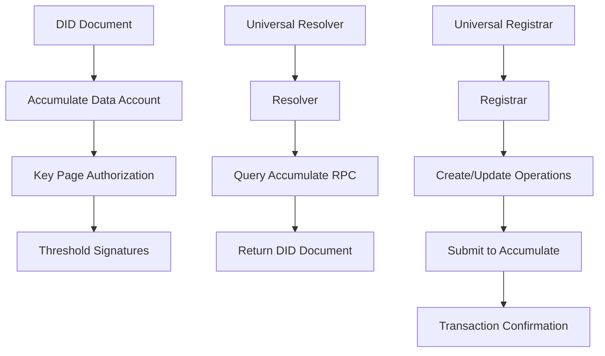

# Accumulate DID Method

The `did:acc` method enables decentralized identifiers on the Accumulate blockchain protocol, providing secure, scalable, and interoperable digital identity solutions.

## Overview

Accumulate DID (`did:acc`) leverages Accumulate's unique architecture to provide:

- **Scalable Identity**: Built on Accumulate's high-throughput blockchain
- **Hierarchical Structure**: Support for organizational and individual identities
- **Key Management**: Integration with Accumulate's key page system
- **Interoperability**: Compatible with W3C DID Core and ecosystem standards

## Architecture



### Key Components

#### DID Format
```
did:acc:<accumulate-adi>
```

Examples:
- `did:acc:alice` - Simple ADI
- `did:acc:beastmode.acme` - Hierarchical ADI

#### Core Services

| Service | Purpose | Port |
|---------|---------|------|
| **Resolver** | DID document resolution | 8080 |
| **Registrar** | DID lifecycle management | 8082 |
| **Universal Resolver Driver** | Standards compliance | 8081 |
| **Universal Registrar Driver** | Standards compliance | 8083 |

#### Verification Methods

The method supports multiple verification method types:

- **AccumulateKeyPage**: Native Accumulate key page integration
- **X25519KeyAgreementKey2020**: For DIDComm and encryption
- **Bls12381G2Key2020**: For BBS+ selective disclosure (planned)

## Quick Start

### 1. Clone and Setup
```bash
git clone https://github.com/opendlt/accu-did.git
cd accu-did
go work sync
```

### 2. Start Services
```bash
# Resolver + Registrar
docker compose up --build

# Or individual services
cd resolver-go && go run cmd/server/main.go
cd registrar-go && go run cmd/server/main.go
```

### 3. Test Resolution
```bash
curl "http://localhost:8080/resolve?did=did:acc:beastmode.acme"
```

## Standards Compliance

- [W3C DID Core 1.0](https://www.w3.org/TR/did-core/)
- [DID Resolution](https://w3c-ccg.github.io/did-resolution/)
- [Universal Resolver](https://github.com/decentralized-identity/universal-resolver)
- [Universal Registrar](https://github.com/decentralized-identity/universal-registrar)

## Next Steps

- [Resolve a DID](resolver.md) - Query existing DID documents
- [Register a DID](registrar.md) - Create and manage DIDs
- [Universal Drivers](universal.md) - Standards-compliant interfaces
- [Go Development](quickstart-go.md) - Build with the Go SDK