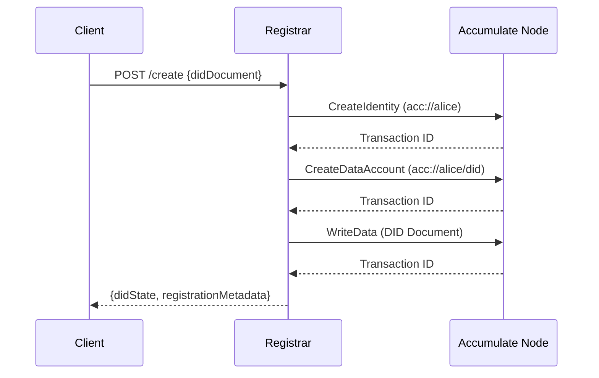
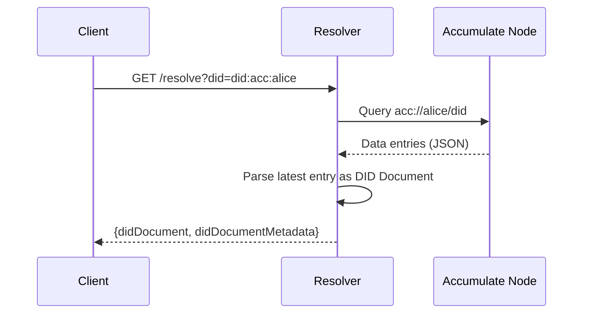

# did:acc — Accumulate DID Method (Draft)

**Status:** Draft, for devnet testing
**Editors:** Accumulate DID Working Group
**Source Repository:** [github.com/opendlt/accu-did](https://github.com/opendlt/accu-did)
**Latest Version:** [docs/spec/method.md](./method.md)

**Non-normative Note:** This specification aligns with [W3C DID Core v1.0](https://www.w3.org/TR/did-core/) and follows patterns established by the [Universal Resolver](https://github.com/decentralized-identity/universal-resolver) and [Universal Registrar](https://github.com/decentralized-identity/universal-registrar) specifications.

## 1. Method Name

The method name for Accumulate DIDs is **`acc`**.

## 2. DID Syntax

### 2.1 Overview

The Accumulate DID method maps human-readable DIDs to Accumulate Digital Identity (ADI) accounts and their associated data accounts:

```
did:acc:<adi>[/<path>][?<query>][#<fragment>]  ↔  acc://<adi>/<path>[?<query>][#<fragment>]
```

Where:
- `<adi>` is a valid Accumulate Digital Identity name
- `<path>` specifies the data account containing the DID Document (defaults to `did`)
- Standard DID URL components (`query`, `fragment`) are preserved

### 2.2 ADI Validation

The `<adi>` component MUST be valid per Accumulate URL rules as validated by `pkg/url`. Accumulate URL validity is normative for this specification.

### 2.3 ABNF (Method-Local, Advisory)

```abnf
did-acc     = "did:acc:" acc-name [ "/" path ] [ "?" query ] [ "#" fragment ]
acc-name    = 1*( ALPHA / DIGIT / "-" / "." )  ; validated by Accumulate pkg/url
path        = *pchar
query       = *pchar
fragment    = *pchar
pchar       = ALPHA / DIGIT / "-" / "_" / "." / "~" / "/" / ":" / "@" / "!" / "$" / "&" / "'" / "(" / ")" / "*" / "+" / "," / ";" / "="
```

### 2.4 DID URL Dereferencing

The **DID Document** lives in the DID data account at `acc://<adi>/did` by convention unless `<path>` explicitly names a different data account root.

**Examples:**
- `did:acc:alice` → DID Document at `acc://alice/did`
- `did:acc:company.example` → DID Document at `acc://company.example/did`
- `did:acc:team/credentials` → DID Document at `acc://team/credentials`

## 3. Method Operations

Accumulate DID operations map to specific Accumulate blockchain transactions:

### 3.1 Create

**Transaction Sequence:**
1. **If ADI does not exist:** Submit `CreateIdentity` transaction to create `acc://<adi>`
2. **Ensure data account exists:** Submit `CreateDataAccount` transaction for `acc://<adi>/did`
3. **Write DID Document:** Submit `WriteData` transaction with initial DID Document as JSON entry

**Returns:**
- DID identifier
- Transaction IDs for each operation
- Accumulate account URLs

### 3.2 Read (Resolve)

**Deterministic Resolution Process:**
1. Map DID to data account URL: `did:acc:<adi>[/<path>]` → `acc://<adi>/<path|did>`
2. Query all data entries from the data account
3. Filter malformed entries (invalid JSON, log warnings)
4. Apply deterministic selection algorithm:
   - **Primary:** Highest sequence number (latest blockchain entry)
   - **Tiebreaker 1:** Latest timestamp if sequences equal
   - **Tiebreaker 2:** SHA256 content hash (lexicographically highest) for deterministic selection
5. If tombstone entry (`"deactivated": true`), return 410 Gone with deactivation metadata
6. Return DID Resolution Result with `application/did+json` content type

**Configurable Ordering:**
- `--resolve-order sequence` (default): Primary sequence → timestamp → hash
- `--resolve-order timestamp`: Primary timestamp → sequence → hash

**Stability Guarantees:**
- Resolution results are deterministic even with network pagination jitter
- Malformed entries are ignored to prevent manipulation
- Content-addressable tiebreaking prevents adversarial influence

### 3.3 Update

**Process:**
1. Validate update request against current DID Document
2. Apply patches or replace with new DID Document
3. Submit `WriteData` transaction appending the updated DID Document

### 3.4 Deactivate

**Canonical Tombstone Process:**
1. Create canonical deactivation tombstone:
   ```json
   {
     "@context": ["https://www.w3.org/ns/did/v1"],
     "id": "<did>",
     "deactivated": true,
     "deactivatedAt": "2024-01-15T10:30:00Z"
   }
   ```
2. Submit `WriteData` transaction with canonical tombstone entry
3. Resolver MUST return 410 Gone status with `didDocumentMetadata.deactivated: true`
4. Response includes minimal deactivated document and content hash for verification

### 3.5 Key Rotation / Recovery

**Accumulate Key Management:**
- Use Accumulate Key Book/Key Page semantics for authorization
- Rotate keys by adding new Verification Methods and updating authentication references
- Support multi-signature operations via Key Book thresholds
- Key recovery follows Accumulate's key hierarchy and threshold policies

## 4. DID Document Conventions

### 4.1 Verification Methods

**Recommended:**
- `Ed25519VerificationKey2020` for Ed25519 keys
- `publicKeyMultibase` encoding for key material

**Example:**
```json
{
  "id": "did:acc:alice#key-1",
  "type": "Ed25519VerificationKey2020",
  "controller": "did:acc:alice",
  "publicKeyMultibase": "z6MkhaXgBZDvotDkL5257faiztiGiC2QtKLGpbnnEGta2doK"
}
```

### 4.2 Controller

**Optional field.** If omitted, controller defaults to the DID subject (`self`).

### 4.3 Services

Any W3C DID Core-compatible service entries are supported.

### 4.4 Method-Specific Metadata

The following MAY be included in `didDocumentMetadata` at resolution time:
- `accAccount`: Accumulate data account URL
- `accTxIds`: Array of transaction IDs for DID Document updates

## 5. Resolution Algorithm

### 5.1 Pseudocode

```
function resolve(did):
  1. Parse DID using pkg/url validation
  2. Extract adi = <adi>, path = <path> || "did"
  3. Construct dataAccountURL = "acc://" + adi + "/" + path
  4. Query dataAccountURL using JSON-RPC v3 client
  5. Retrieve latest data entry containing DID Document
  6. If entry contains {"deactivated": true}:
     return ResolutionResult with deactivated=true metadata
  7. Parse JSON entry as DID Document
  8. Return ResolutionResult with DID Document and metadata
```

### 5.2 Default Account Selection

- **Default:** `acc://<adi>/did` unless DID path explicitly directs otherwise
- **Path Override:** `did:acc:company/credentials` → `acc://company/credentials`

### 5.3 Deactivation Handling

If a deactivated tombstone is present in the latest entry, the resolver MUST return `deactivated: true` in `didDocumentMetadata`.

## 6. Security & Privacy

### 6.1 Identity Linkage

**Consideration:** Human-readable ADI names may create linkage opportunities between transactions and real-world identities.

**Recommendations:**
- Use pseudonymous ADI names for privacy-sensitive applications
- Separate operational keys from identity keys
- Implement key rotation policies for long-lived identities

### 6.2 Key Management

**Best Practices:**
- Rotate verification keys regularly
- Use separate signing keys for different contexts
- Configure appropriate Key Book thresholds for high-value operations
- Avoid embedding personally identifiable information (PII) in DID Documents

### 6.3 Replay Protection

Replay resistance is provided by Accumulate's consensus mechanism and sequential ordering of data entries.

### 6.4 Input Validation

Registrar implementations SHOULD validate all inputs and reject malformed DID Documents to prevent invalid state.

## 7. Examples

### 7.1 Minimal DID

**DID:** `did:acc:beastmode.acme`

**Resolved DID Document:**
```json
{
  "@context": ["https://www.w3.org/ns/did/v1"],
  "id": "did:acc:beastmode.acme",
  "verificationMethod": [{
    "id": "did:acc:beastmode.acme#key-1",
    "type": "Ed25519VerificationKey2020",
    "controller": "did:acc:beastmode.acme",
    "publicKeyMultibase": "z6MkhaXgBZDvotDkL5257faiztiGiC2QtKLGpbnnEGta2doK"
  }],
  "authentication": ["did:acc:beastmode.acme#key-1"],
  "assertionMethod": ["did:acc:beastmode.acme#key-1"]
}
```

### 7.2 DID with Explicit Path

**DID:** `did:acc:team.alpha/credentials`
**Data Account:** `acc://team.alpha/credentials`

### 7.3 Deactivated DID Resolution

**Response:**
```json
{
  "didDocument": {
    "@context": ["https://www.w3.org/ns/did/v1"],
    "id": "did:acc:beastmode.acme",
    "deactivated": true
  },
  "didDocumentMetadata": {
    "deactivated": true,
    "versionId": "3",
    "updated": "2024-01-15T10:30:00Z"
  },
  "didResolutionMetadata": {
    "contentType": "application/did+json"
  }
}
```

## 8. Error Handling

| HTTP Status | Error Condition | Response Body |
|-------------|----------------|---------------|
| `404` | DID not found (no ADI or data account) | `{"error": "notFound", "errorMessage": "DID not found"}` |
| `410` | DID deactivated | `{"error": "deactivated", "errorMessage": "DID has been deactivated"}` |
| `422` | Invalid DID syntax | `{"error": "invalidDid", "errorMessage": "Invalid DID format"}` |
| `502` | Accumulate node unavailable | `{"error": "methodNotSupported", "errorMessage": "Accumulate node unavailable"}` |

## 9. Test Vectors (Devnet)

| DID | Accumulate URL | Example Entry Hash | Status |
|-----|----------------|-------------------|--------|
| `did:acc:alice` | `acc://alice/did` | `sha256:abc123...` | Active |
| `did:acc:beastmode.acme` | `acc://beastmode.acme/did` | `sha256:def456...` | Deactivated |
| `did:acc:company/docs` | `acc://company/docs` | `sha256:789xyz...` | Active |

**Note:** Test vectors will be updated as CI fixtures evolve with the implementation.

## 10. Fees & Credits

Accumulate uses a fixed, stable credit system for transaction fees. The following are the key costs for DID operations:

| DID Operation | Credits | USD (Approx) |
|---------------|---------|--------------|
| Create ADI (8+ chars) | 500.00 | $5.0000 |
| Create Data Account | 25.00 | $0.2500 |
| Write DID Document | 0.10 | $0.0010 |
| **Complete DID Setup** | **~525.10** | **~$5.25** |

**Important Notes:**
- USD values shown are estimates for illustration; credits are the unit of account
- Short ADI names (1-7 characters) cost significantly more following a sliding scale
- Size-based surcharges may apply for large transactions
- Failed transactions may be partially refunded

👉 **[Complete fee schedule and operational details](../ops/OPERATIONS.md#fees--credits)**

## 11. IANA & Registry Considerations

**IANA Action:** None required for this specification.

**DID Method Registration:** Registration in public DID Method registries (DIF/W3C processes) is out-of-scope for this draft and will be addressed in future revisions.

## Appendix A. Sequence Diagrams

### A.1 Create Flow



### A.2 Resolve Flow



---

**Document Version:** Draft v1.1
**Last Updated:** 2025-09-23
**Next Review:** TBD based on implementation feedback