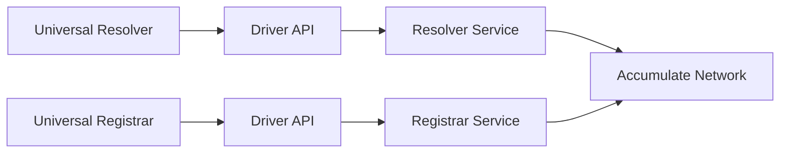

# Universal Resolver & Registrar Drivers

Standards-compliant drivers for integration with Universal Resolver and Universal Registrar ecosystems.

## Overview

The Accumulate DID method provides two Universal drivers:

- **Universal Resolver Driver**: Standards-compliant DID resolution
- **Universal Registrar Driver**: Standards-compliant DID registration

## Architecture



## Running with Docker Compose

### Universal Resolver Driver

```bash
cd drivers/uniresolver-go
docker compose up --build
```

Services:
- **Resolver**: `http://localhost:8080`
- **Driver**: `http://localhost:8081`

### Universal Registrar Driver

```bash
cd drivers/uniregistrar-go
docker compose up --build
```

Services:
- **Registrar**: `http://localhost:8082`
- **Driver**: `http://localhost:8083`

## Universal Resolver Driver API

### GET /1.0/identifiers/{did}

Resolves a DID according to Universal Resolver specification.

#### Request Example

```bash
curl -X GET "http://localhost:8081/1.0/identifiers/did:acc:beastmode.acme" \
     -H "Accept: application/did+ld+json"
```

#### Response Example

```json
{
  "didDocument": {
    "@context": [
      "https://www.w3.org/ns/did/v1",
      "https://w3id.org/security/v1"
    ],
    "id": "did:acc:beastmode.acme",
    "verificationMethod": [
      {
        "id": "did:acc:beastmode.acme#key-1",
        "type": "AccumulateKeyPage",
        "controller": "did:acc:beastmode.acme",
        "keyPageUrl": "acc://beastmode.acme/book/1",
        "threshold": 1
      }
    ],
    "authentication": ["#key-1"],
    "assertionMethod": ["#key-1"]
  },
  "didDocumentMetadata": {
    "created": "2024-01-01T12:00:00Z",
    "versionId": "1705329000-7c8d9e0f"
  },
  "didResolutionMetadata": {
    "contentType": "application/did+ld+json",
    "duration": 42,
    "did": {
      "didString": "did:acc:beastmode.acme",
      "methodSpecificId": "beastmode.acme",
      "method": "acc"
    }
  }
}
```

### GET /

Driver metadata endpoint.

#### Request Example

```bash
curl -X GET "http://localhost:8081/" \
     -H "Accept: application/json"
```

#### Response Example

```json
{
  "driver": "did-acc",
  "version": "1.0.0",
  "methods": ["acc"],
  "endpoints": {
    "resolve": "/1.0/identifiers/{did}"
  }
}
```

## Universal Registrar Driver API

### POST /1.0/create?method=acc

Creates a DID according to Universal Registrar specification.

#### Request Example

```bash
curl -X POST "http://localhost:8083/1.0/create?method=acc" \
     -H "Content-Type: application/json" \
     -d '{
       "did": "did:acc:alice",
       "didDocument": {
         "@context": ["https://www.w3.org/ns/did/v1"],
         "id": "did:acc:alice",
         "verificationMethod": [
           {
             "id": "did:acc:alice#key-1",
             "type": "AccumulateKeyPage",
             "controller": "did:acc:alice",
             "keyPageUrl": "acc://alice/book/1",
             "threshold": 1
           }
         ]
       },
       "options": {},
       "secret": {}
     }'
```

#### Response Example

```json
{
  "jobId": "job-1705329000123456789",
  "didState": {
    "did": "did:acc:alice",
    "state": "finished",
    "action": "create"
  },
  "didRegistrationMetadata": {
    "versionId": "1705329000-abc12345",
    "contentHash": "8f434346648f6b96df89dda901c5176b10e6d8b9b1ee1e6e6e5e8e3d5c7c2e1a",
    "txId": "0x9876543210fedcba9876543210fedcba98765432"
  },
  "didDocumentMetadata": {
    "created": "2024-01-15T14:30:00Z",
    "versionId": "1705329000-abc12345"
  }
}
```

### POST /1.0/update?method=acc

Updates a DID.

#### Request Example

```bash
curl -X POST "http://localhost:8083/1.0/update?method=acc" \
     -H "Content-Type: application/json" \
     -d '{
       "did": "did:acc:alice",
       "didDocument": {
         "@context": ["https://www.w3.org/ns/did/v1"],
         "id": "did:acc:alice",
         "verificationMethod": [
           {
             "id": "did:acc:alice#key-1",
             "type": "AccumulateKeyPage",
             "controller": "did:acc:alice",
             "keyPageUrl": "acc://alice/book/1",
             "threshold": 2
           }
         ]
       }
     }'
```

### POST /1.0/deactivate?method=acc

Deactivates a DID.

#### Request Example

```bash
curl -X POST "http://localhost:8083/1.0/deactivate?method=acc" \
     -H "Content-Type: application/json" \
     -d '{
       "did": "did:acc:alice"
     }'
```

## Smoke Testing

Both drivers include automated smoke tests.

### Universal Resolver Smoke Test

```powershell
cd drivers/uniresolver-go
./smoke.ps1
```

Expected output:
```
Universal Resolver Driver Smoke Test
====================================

✓ Health check passed
✓ Driver info retrieved
✓ DID resolved successfully

All tests passed!
```

### Universal Registrar Smoke Test

```powershell
cd drivers/uniregistrar-go
./smoke.ps1
```

Expected output:
```
Universal Registrar Driver Smoke Test
=====================================

✓ Health check passed
✓ Driver info retrieved
✓ DID created successfully

All tests passed!
```

## Integration with Universal Infrastructure

### Universal Resolver

To register with the Universal Resolver:

1. Fork [universal-resolver](https://github.com/decentralized-identity/universal-resolver)
2. Add driver configuration:

```yaml
# docker-compose.yml
uni-resolver-driver-did-acc:
  image: yourorg/uni-resolver-driver-did-acc
  ports:
    - "8081:8081"
  environment:
    - RESOLVER_URL=http://resolver:8080
```

3. Update driver registry:

```json
{
  "pattern": "^did:acc:.*",
  "url": "http://uni-resolver-driver-did-acc:8081/1.0/identifiers/"
}
```

### Universal Registrar

Similar process for Universal Registrar integration:

```yaml
# docker-compose.yml
uni-registrar-driver-did-acc:
  image: yourorg/uni-registrar-driver-did-acc
  ports:
    - "8083:8083"
  environment:
    - REGISTRAR_URL=http://registrar:8082
```

## Standards Compliance

- [Universal Resolver](https://github.com/decentralized-identity/universal-resolver)
- [Universal Registrar](https://github.com/decentralized-identity/universal-registrar)
- [DID Resolution](https://w3c-ccg.github.io/did-resolution/)
- [DID Registration](https://identity.foundation/did-registration/)